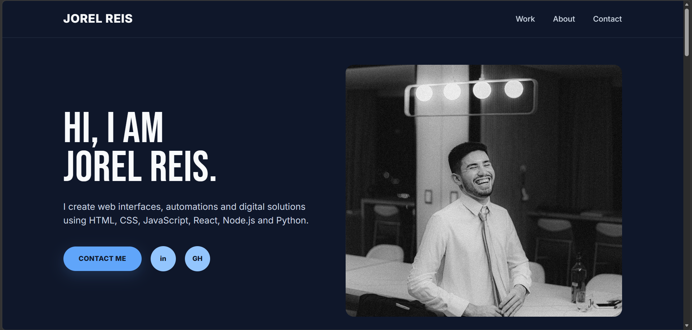
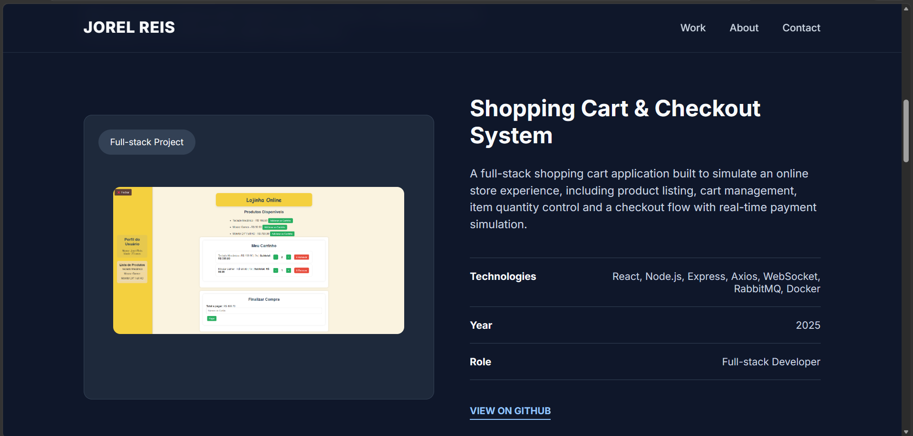
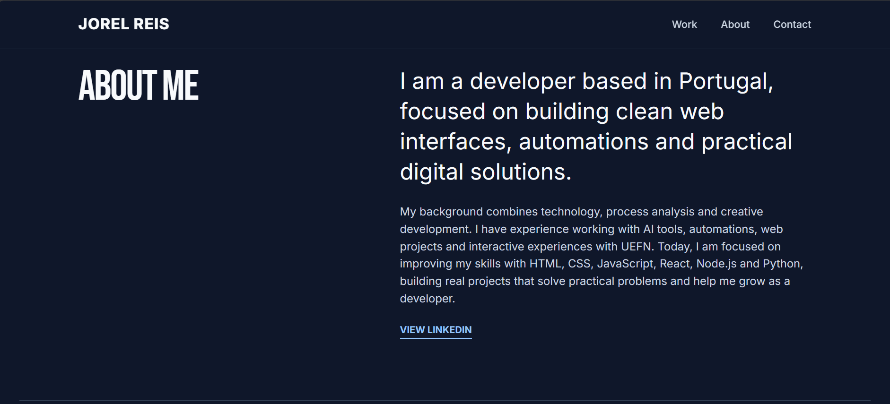
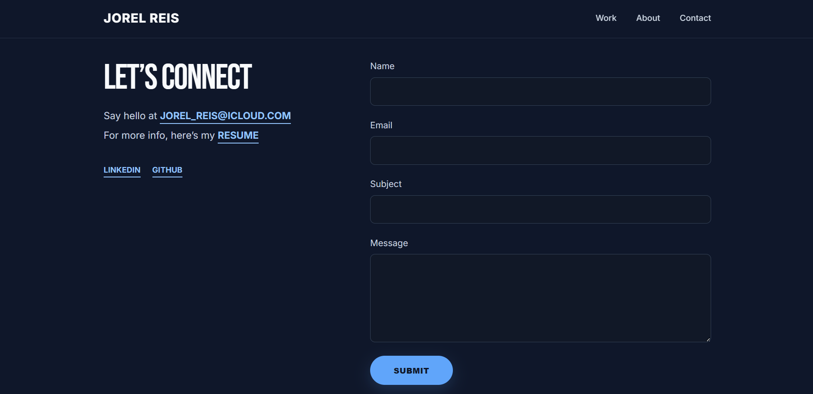

# Jorel Reis | Developer Portfolio



## 📌 About the Project

This is my personal developer portfolio, created to present my projects, skills, professional journey and contact information in a clean and modern way.

The main goal of this project is to build a professional online presence as a developer, while also practicing the fundamentals of front-end development using HTML, CSS and JavaScript.

This portfolio is still under development and will continue to receive improvements in layout, responsiveness, animations, accessibility and project presentation.

---

## 🚀 Project Preview

### Home Section


### Featured Projects



### About Me



### Contact Section



---

## 🛠️ Technologies Used

This project was built using:

- HTML5
- CSS3
- JavaScript
- Git
- GitHub
- Figma

---

## ✨ Features

- Modern and responsive layout
- Fixed navigation bar
- Personal introduction section
- Featured projects section
- About me section
- Contact form layout
- Links to LinkedIn and GitHub
- Custom colors and typography
- Project images and descriptions
- Clean structure for future improvements

---

## 📂 Project Structure

```bash
portfolio-jorel/
│
├── assets/
│   ├── images/
│   │   ├── jorel-photo.png
│   │   ├── shopee-cart.png
│   │   ├── ai-chat.png
│   │   └── pokedex.png
│   │
│   └── readme/
│       ├── preview-home.png
│       ├── preview-projects.png
│       ├── preview-about.png
│       └── preview-contact.png
│
├── index.html
├── style.css
├── script.js
└── README.md
```
