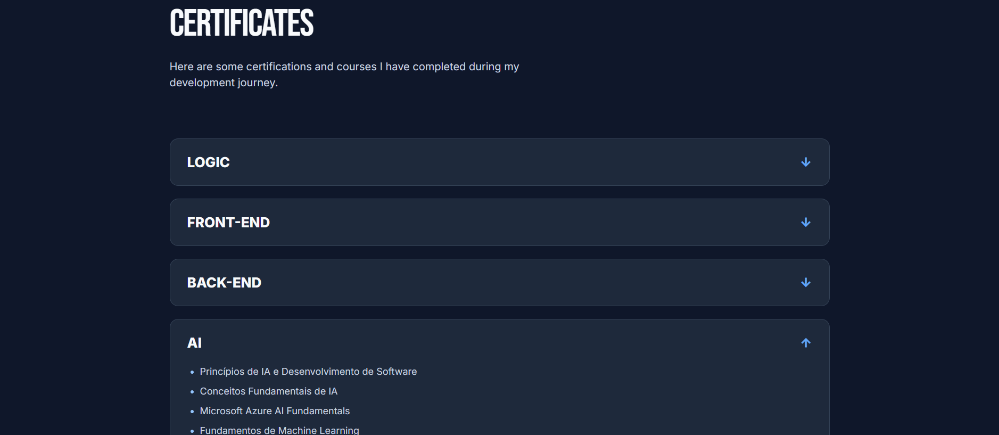

# Jorel Reis | Developer Portfolio


## 📌 About the Project

This is my personal developer portfolio, created to present my projects, skills, certificates, professional journey and contact information in a clean and modern way.

The main goal of this project is to build a professional online presence as a developer while practicing front-end fundamentals with **HTML, CSS and JavaScript**.

The portfolio was designed based on a Figma layout reference and developed step by step in VS Code, with version control using Git and GitHub.

This project is still under development and will continue to receive improvements in responsiveness, accessibility, animations, content and deployment.

---

## 🚀 Project Preview

### Home Section


### Featured Projects


### About Me


### Certificates



### Contact


---

## 🛠️ Technologies Used

This project was built using:

- HTML5
- CSS3
- JavaScript
- Git
- GitHub
- Figma
- Formspree

---

## ✨ Features

- Modern and clean portfolio layout
- Dark and light mode toggle
- Portuguese and English language switch
- Fixed navigation bar
- Personal introduction section
- Featured projects section
- About me section
- Certificates section with PDF links
- Contact form connected with Formspree
- Links to LinkedIn and GitHub
- Custom colors and typography
- Responsive layout in progress
- Organized project structure

---

## 📂 Project Structure

```bash
portfolio-jorel/
│
├── assets/
│   │
│   ├── images/
│   │   ├── jorel-photo.png
│   │   ├── shopee-cart.png
│   │   ├── ai-chat.png
│   │   └── pokedex.png
│   │
│   ├── readme/
│   │   ├── preview-home.png
│   │   ├── preview-projects.png
│   │   ├── preview-about.png
│   │   ├── preview-certificates.png
│   │   └── preview-contact.png
│   │
│   └── certificates/
│       ├── ai/
│       ├── back-end/
│       ├── front-end/
│       └── logic/
│
├── index.html
├── style.css
├── script.js
└── README.md
```

---

## 💻 How to Run Locally

To run this project on your computer:

1. Clone the repository:

```bash
git clone https://github.com/JorelReis/portfolio-jorel.git
```

2. Open the project folder:

```bash
cd portfolio-jorel
```

3. Open the project in VS Code:

```bash
code .
```

4. Open the `index.html` file in your browser.

For a better development experience, you can use the **Live Server** extension in VS Code.

---

## 🌗 Theme Toggle

The portfolio includes a dark/light mode toggle built with JavaScript.

The selected theme is saved in the browser using `localStorage`, so the user's preference remains active even after refreshing the page.

---

## 🌍 Language Switch

The site includes a Portuguese/English language switch.

The translation system was built manually using JavaScript objects and `data-i18n` attributes in the HTML.

This allows the page content to change dynamically without reloading the website.

---

## 📜 Certificates Section

The portfolio includes a certificates section organized by category:

- Logic
- Front-End
- Back-End
- AI

Each certificate is displayed as a clickable link that opens the corresponding PDF file in a new browser tab.

---

## 📬 Contact Form

The contact form is connected with **Formspree**, allowing visitors to send messages directly through the portfolio website.

The form includes:

- Name
- Email
- Subject
- Message

---

## 📸 Featured Projects

The portfolio currently highlights some of my main development projects:

### Shopping Cart & Checkout System

A full-stack shopping cart application built to simulate an online store experience, including product listing, cart management, item quantity control and checkout flow.

### AI Chat Application

An AI-powered chat application that allows users to send questions and receive dynamic responses through an OpenAI API integration, using a modular frontend and backend structure.

### Pokedex Web App

A responsive front-end application that consumes the PokéAPI to display Pokémon data, including images, types, stats, pagination and search by name or ID.

---

## 📚 What I Learned

During the development of this project, I practiced:

- Structuring a web page with semantic HTML
- Styling layouts with CSS
- Creating reusable sections
- Working with colors, typography and spacing
- Building a dark/light mode toggle
- Creating a simple translation system with JavaScript
- Organizing certificates and assets
- Connecting a contact form with Formspree
- Using Git and GitHub for version control
- Building a professional portfolio from a Figma design reference

---

## 🔄 Future Improvements

Some improvements planned for the next versions:

- Improve mobile responsiveness
- Add smooth scroll animations
- Improve accessibility
- Add real live demo links for each project
- Add a downloadable resume
- Refine project descriptions
- Improve contact form feedback
- Publish the website with a custom domain

---

## 🌐 Deployment

The project is currently under development.

A live version will be published soon with a custom professional domain.

---

## 👨‍💻 Author

**Jorel Reis**

- GitHub: [@JorelReis](https://github.com/JorelReis)
- LinkedIn: [Jorel Reis](https://www.linkedin.com/in/jorelreis/)

---

## 📄 License

This project is open for study and portfolio purposes.
