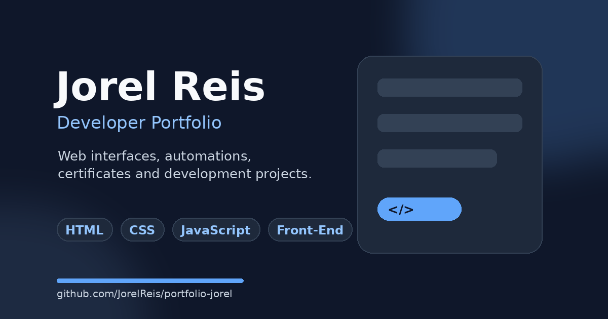

# Jorel Reis | Developer Portfolio


> Personal portfolio showcasing projects, skills and certificates — built with pure HTML, CSS and JavaScript, no frameworks.

**Live → [jorelreis.com](https://www.jorelreis.com)**



---

## About

Personal portfolio of Jorel Reis, junior web developer based in Portugal. Built from scratch with no frameworks — every line of HTML, CSS and JavaScript is hand-written and audited for accessibility (WCAG AA). The codebase is intentionally framework-free to demonstrate fundamentals.

---

## Features

| Feature | Detail |
|---|---|
| Bilingual | English / Portuguese toggle, preference saved via `localStorage` |
| Dark / Light mode | Theme toggle, preference saved via `localStorage` |
| Accessibility | WCAG AA — skip link, `aria-*` attributes, semantic HTML, `lang` updates dynamically on language switch |
| Social previews | Open Graph and Twitter Card meta tags, validated via LinkedIn Post Inspector |
| Optimized assets | Hero image converted to WebP (75% smaller, 2.79 MB → 691 KB), with `fetchpriority="high"` and explicit dimensions to prevent layout shift |
| Contact form | Async submission via Formspree with loading, success and error states |
| Lazy loading | Below-fold images load on demand (`loading="lazy"`) |
| Responsive | Mobile and desktop layouts |

---

## Tech Stack

- **HTML5** — semantic structure, accessibility attributes
- **CSS3** — custom properties, no external frameworks
- **Vanilla JavaScript** — i18n system, theme toggle, async form submission
- **Formspree** — contact form backend
- **Vercel** — hosting and deployment

---

## Performance

Lighthouse scores:

| Device  | Performance | Accessibility | Best Practices | SEO |
|---------|:-----------:|:-------------:|:--------------:|:---:|
| Desktop | 98          | 100           | 100            | 100 |
| Mobile  | 68          | 100           | 100            | 100 |

LCP optimized: hero image served as WebP (691 KB vs 2.79 MB original PNG) with `fetchpriority="high"` and explicit `width`/`height` to prevent layout shift (CLS).

---

## Project Structure

```
portfolio-jorel/
├── assets/
│   ├── images/
│   │   ├── jorel-photo.webp
│   │   ├── shopee-cart.png
│   │   ├── ai-chat.png
│   │   ├── pokedex.png
│   │   └── og-preview.png
│   ├── certificates/
│   │   ├── ai/
│   │   ├── back-end/
│   │   ├── front-end/
│   │   └── logic/
│   ├── favicon.ico
│   ├── favicon.png
│   └── apple-touch-icon.png
├── index.html
├── style.css
├── script.js
└── README.md
```

---

## Running Locally

```bash
git clone https://github.com/JorelReis/portfolio-jorel.git
cd portfolio-jorel
```

Open `index.html` in your browser, or use the [Live Server](https://marketplace.visualstudio.com/items?itemName=ritwickdey.LiveServer) extension in VS Code for hot reload.

No build step, no dependencies.

---

## Contact

- LinkedIn: [linkedin.com/in/jorelreis](https://www.linkedin.com/in/jorelreis/)
- Email: jorelreis@icloud.com

---

## License

MIT
